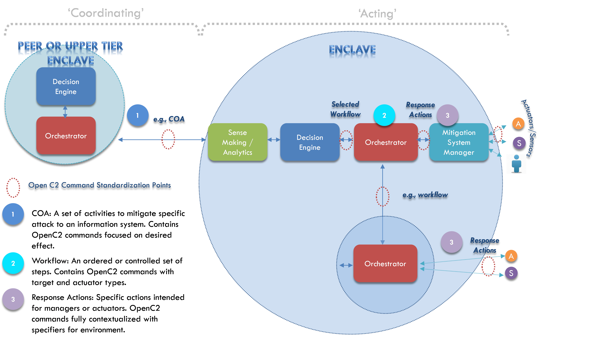

# [1. Introduction](1_introduction.md#1-introduction)

# 2. Background
## 2.1 Design Principles

OpenC2 can be implemented in a variety of systems to perform the secure delivery and management of command and control messages in a context-specific way. OpenC2 commands are vendor neutral and message fabric agnostic, thus can be incorporated in different architectures and environments (i.e. connection oriented, connectionless, pub-sub, hub and spoke, etc.).

OpenC2 was designed to have a concise set of core actions that are extensible through attributes and modifiers to the language to provide context specific details. Conciseness ensures minimal overhead to meet possible latency and overhead constraints while extensions enable greater utility and flexibility.

There is an underlying assumption that issuing OpenC2 commands are event-driven and that an action is warranted. OpenC2 was designed to focus on the actions that are to be executed in order to thwart an attack, mitigate some vulnerability or otherwise address a threat. The exchange of indicators, rationale for the decision to act, authentication and/or information sharing are beyond the scope of OpenC2 and left to other standards such as STIX.

The actual performance and efficacy of OpenC2 will be implementation-specific and will require the incorporation of other technologies. The OpenC2 design principles include the following:

-   Support cyber relevant response time for coordination and response actions.
-   Be infrastructure, architecture, and vendor agnostic.
-   Support multiple levels of abstraction, necessary to permit the contextualization of commands for a wide variety of operating environments.
-   Permit commands to be invoked that are either tasking/response actions or notifications.

    -   Tasking/response actions result in a state change.

    -   Notifications require supporting analytics/decision processes.

-   Provide an extensible syntax to accommodate different types of actions, targets, and actuators (e.g., sensor, endpoint, network device, human) and specific targets and actuators.
-   Ensure the OpenC2 command is independent of a message construct that provides transport, identifies priority/ quality of service, and supports security attributes.

Traditional command and control implementations utilize complete, self-standing constructs. OpenC2 decouples the actions from the targets of the actions and from the recipients of the commands. An OpenC2 command is not complete until an action is paired with a target, providing the command context for the action. This enables the OpenC2 language to be more concise, yet still support the entire C2 space. This characteristic of OpenC2 also permits a more flexible and extensible approach to accommodate future technologies and varying network environments.

## 2.2 OpenC2 and Deployment Environments

OpenC2 is defined at a level of abstraction such that an inter-domain tasking or coordination effort can be described without requiring in depth knowledge of the recipient network’s components, but through the use of specifiers and modifiers, enough detail can be appended to carry out specific tasks on particular devices to support intra-domain command and control.

This level of abstraction permits end to end applicability of OpenC2. As depicted in Figure 2-1, an OpenC2 command is sent to enable coordination or send a high level tasking from the peer or upper tier enclave. An OpenC2 command received by an enclave will trigger events within the enclave to annotate the command with context specific information so that specific devices within the enclave can respond appropriately. This allows the enclave to take advantage of this context-specific knowledge to interpret OpenC2 commands (e.g., inventory of actuators controlled by the enclave, the local security policy, the communication paths and protocols available, and the command structure of the enclave).

Each domain or enclave contextualizes an OpenC2 action for the specific sensors and actuators within its environment so it can further specify the command to reflect the implementations of which it is capable. Context-specific modifiers provide an ability to further specify the action while enabling the set of actions to remain tightly constrained. This minimizes the overhead, permits further contextualization of the OpenC2 commands for specific environments, and thereby enables flexibility and extensibility. 

**Figure 2-1. OpenC2 Deployment Environments**

For example, an organization may have executed a series of actions to protect against a particular attack that was signaled by an external indicator (such as a STIX message). In order to elicit a consistent response across an organization (whether hierarchical or peer to peer), a complex course of action can be constructed and shared. The use of standardized and unambiguous OpenC2 commands to communicate a responsive action between enterprises/enclaves will be more precise and more quickly actionable than a set of recommended steps within a text document (e.g., flash), which must be parsed, analyzed, interpreted, and executed. Standardizing OpenC2 commands helps to ensure a more uniform response at enterprises/enclaves that reflects enterprise-wide level decisions.

# [3. OpenC2 Language](3.0_openc2-language.md#3-openc2-language)
