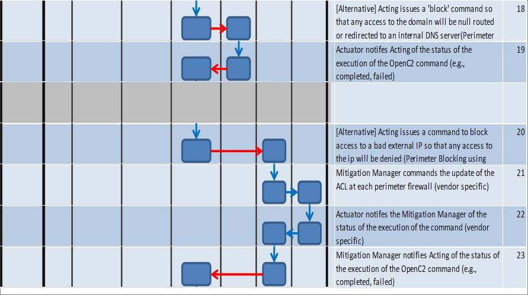

# Use Case: Mitigate Evil Domain
## Description

A cyber threat analyst reviews structured and unstructured information regarding cyber threat activity from a variety of manual or automated input sources. The analyst sets out to understand the nature of relevant threats, identify them, and fully characterize them such that all of the relevant knowledge of the threat can be fully expressed and evolved over time. This relevant knowledge includes threat-related actions, behaviors, capabilities, intents, and attributed actors. From this understanding and characterization, the analyst at an upper tier determines that a domain is “evil”. The upper tier notifies lower level enclaves of the need to mitigate against this evil domain.

## Stakeholders/Goals

Upper Tier shares threat intelligence with lower tier. Lower tier acts on the shared threat intelligence.

## Preconditions

Upper and lower tier have pre-established a trust relationship.

**Figure. Scenario Diagram: Mitigate Evil Domain**

**Table. Scenario Steps: Mitigate Evil Domain**

|  | DESCRIPTION | ACTION | TARGET
TARGET-SPECIFIER | ACTUATOR
ACTUATOR-SPECIFIER | MODIFIER | 
| :--- | :--- | :--- | :--- | :--- | :--- | 
| 1 |  |  | 
 | 
 |  | 
| 2 | External Enclave determines that there is a need to coordinate with other networks for the mitigation against an evil domain. |  | 
 | 
 |  | 
| 3 | External Enclave sends the COA containing an action to mitigate against the evil domain to the Enclave. | MITIGATE | cybox:Domain_Name
Value =  "mymalware.com" | 
 |  | 
| 4 | Sense-Making at the Enclave provides the COA containing an action to mitigate against the evil domain to Decision-Making. |  | 
 | 
 |  | 
| 5 | Decision-Making commands Acting to send an application level Acknowledgement for the receipt of the COA.  | NOTIFY | cybox:System
cybox:SystemObjectType | 
 | message = acknowledge | 
| 6 | Acting sends the Acknowledgement for the receipt of the COA to the External Enclave. <Dependency: UUID for command from External Enclave> | RESPONSE | 
 | 
 | type = acknowledge, command = MITIGATE reference | 
| 7 |  |  | 
 | 
 |  | 
| 8 | Decision-Making commands Acting to request additional Sense-Making analytics and environmental conditions. | SCAN | cybox:Domain_Name
Value =  "mymalware.com" | 
 |  | 
| 9 | Acting requests additional Sense-Making to support the Decision-Making process.  | SCAN | cybox:Domain_Name
Value =  "mymalware.com" | network.sense_making
(specifier) |  | 
| 10 | Sense-Making at the Enclave combines the COA with additional analytic results and provides the information to Decision-Making. |  | 
 | 
 |  | 
| 11 | Decision-Making utilizes the results of Sense-Making to determine the response to the received COA. |  | 
 | 
 |  | 
| 12 | Decision-Making commands Acting to execute an action plan comprised of one or more mitigation steps.  | START | cybox:Process
Name = "MITIGATE Plan XX" | 
 |  | 
| 13 | Acting contextualized the mitigation steps. |  | 
 | 
 |  | 
| 14 | Acting notifies an authorized user of the new action plan.  Acting awaits approval before proceeding. | NOTIFY | cybox:User_Account
Username | endpoint.server
(specifier) | message = "approval request" | 
| 15 | Upon approval, Acting commands a firewall to block packets. | DENY | cybox:Network_Connection
Source Socket Address:   IP Address = "8.8.8.8",   Port = [80, 443]) | network.firewall
(specifier) |  | 
|  | ALTERNATIVE ACTIONS |  | 
 | 
 |  | 
| 16 | [Alternative] Acting commands host remediation manager to update all endpoints' browser settings to block the evil domain. | DENY | cybox:Domain_Name
Value =  "mymalware.com" | process.remediation-service
(specifier) |  | 
| 17 | Mitigation Manager commands the update of each endpoint's browser settings. |  | 
 | 
 |  | 
|  |  |  | 
 | 
 |  | 
| 18 | [Alternative] Acting issues a 'block' command so that any access to the domain will be null routed or redirected to an internal DNS server(Perimeter Blocking: DNS Sink Hole) | DENY | cybox:Network_Connection
Source Socket Address:   IP Address = "8.8.8.8",   Port = [80, 443]) | network.router
(specifier) | method = "sinkhole" | 
| 19 | Actuator notifes Acting of the status of the execution of the OpenC2 command (e.g., completed, failed) | RESPONSE | 
 | 
type = status, value = complete, command = DENY reference |  | 
|  |  |  | 
 | 
 |  | 
| 20 | [Alternative] Acting issues a command to block access to a bad external IP so that any access to the ip will be denied (Perimeter Blocking using ACLs on the perimeter firewalls) | DENY | cybox:Network_Connection
Source Socket Address:   IP Address = "8.8.8.8",   Port = [80, 443]) | network.router
(specifiy perimeter routers) | method = "acl" | 
| 21 | Mitigation Manager commands the update of the ACL at each perimeter firewall (vendor specific) |  | 
 | 
 |  | 
| 22 | Actuator notifes the Mitigation Manager of the status of the execution of the command (vendor specific) |  | 
 | 
 |  | 
| 23 | Mitigation Manager notifies Acting of the status of the execution of the OpenC2 command (e.g., completed, failed) | RESPONSE | 
 | 
type = status, value = complete, command = DENY reference |  | 

